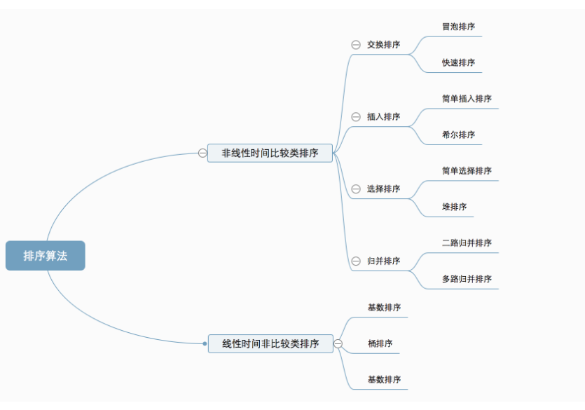
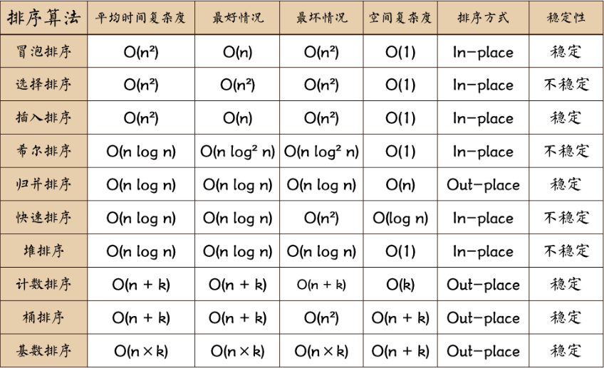

# 排序

<!-- TOC -->

- [排序](#排序)
  - [线性分类](#线性分类)
  - [排序方式比较](#排序方式比较)
  - [排序算法详解](#排序算法详解)
    - [冒泡排序（Bubble Sort）](#冒泡排序bubble-sort)
    - [选择排序](#选择排序)
    - [插入排序](#插入排序)
    - [希尔排序](#希尔排序)
    - [归并排序](#归并排序)
    - [快速排序](#快速排序)
    - [堆排序](#堆排序)
    - [计数排序](#计数排序)
    - [桶排序](#桶排序)

<!-- /TOC -->

## 线性分类

**非线性时间比较类排序**：通过比较来决定元素间的相对次序，由于其时间复杂度不能突破O(nlogn)，因此称为非线性时间比较类排序。 
**线性时间非比较类排序**：不通过比较来决定元素间的相对次序，它可以突破基于比较排序的时间下界，以线性时间运行，因此称为线性时间非比较类排序。 

## 排序方式比较

备注： 
（1）稳定：如果a原本在b前面，而a=b，排序之后a仍然在b的前面； 
（2）不稳定：如果a原本在b的前面，而a=b，排序之后a可能会出现在b的后面； 
（3）内排序：所有排序操作都在内存中完成； 
（4）外排序：由于数据太大，因此把数据放在磁盘中，而排序通过磁盘和内存的数据传输才能进行； 

## 排序算法详解

### 冒泡排序（Bubble Sort）

**基本思想**：两个数比较大小，较大的数下沉，较小的数冒起来。
**算法描述**：
（1）比较相邻的元素。如果第一个比第二个大，就交换它们两个；
（2）对每一对相邻元素作同样的工作，从开始第一对到结尾的最后一对，这样在最后的元素应该会是最大的数；
（3）针对所有的元素重复以上的步骤，除了最后一个；
（4）重复步骤1~3，直到排序完成。
**动图演示**：

### 选择排序

### 插入排序

### 希尔排序

### 归并排序

### 快速排序

### 堆排序

### 计数排序

### 桶排序
